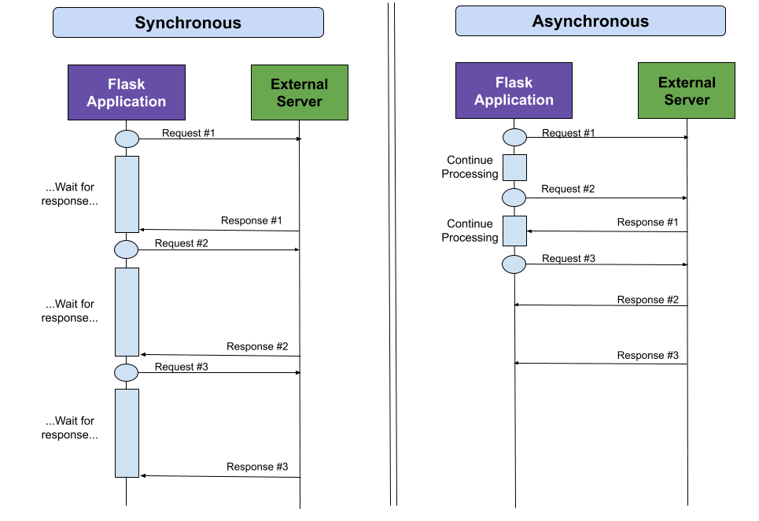

HTTP (Hypertext Transfer Protocol) is a protocol used for transferring data over the web. There are several HTTP methods (also known as HTTP verbs) that define the actions a client can perform on a server. These methods have specific use cases and are essential for various web operations. Explaining these methods in a kid-friendly manner involves simplifying technical jargon and focusing on practical examples. Here are some common HTTP methods and their simplified explanations for kids:

1. **GET**:

   - **Use**: GET is like asking for information from a website. It's used when you want to see a web page, read an article, or view pictures.
   - **Example**: When you type a web address in a browser and press Enter, you are sending a GET request to the server to fetch and show the web page.

2. **POST**:

   - **Use**: POST is like sending a letter or a message. It's used when you want to send data to a server, such as filling out a form, posting a comment, or submitting a quiz.
   - **Example**: When you fill out a form on a website (like entering your name and email to sign up), clicking the submit button sends a POST request to the server with your information.

3. **PUT**:

   - **Use**: PUT is like updating or changing something. It's used when you want to update a resource on the server, such as editing your profile information or changing a password.
   - **Example**: Imagine you have a profile on a website, and you want to change your profile picture. You can use a PUT request to send the new picture to the server.

4. **DELETE**:

   - **Use**: DELETE is like removing or deleting something. It's used when you want to delete a resource from the server, such as deleting a post, removing a photo, or canceling a subscription.
   - **Example**: If you posted something on a social media site and later decided to remove it, you would use a DELETE request to ask the server to delete that post.

5. **PATCH**:
   - **Use**: PATCH is like making small changes or updates. It's used when you want to update part of a resource without replacing the entire resource, such as editing a specific section of a document or modifying settings.
   - **Example**: If you have a document online and you only want to change a few words in a paragraph, you can use a PATCH request to send those changes to the server without sending the entire document again.

These simplified explanations can help kids understand the basic concepts behind HTTP methods and how they are used in everyday web interactions.

So, synchronous API calls are like waiting for a direct answer, while asynchronous API calls are like sending a message and doing other things while waiting for a response. Both ways have their uses depending on what you need to do in your program!

Here are some common HTTP response messages along with their status codes:

1. **OK**

   - Status Code: 200
   - Meaning: The request was successful, and the server has returned the requested content. This is the standard response for successful HTTP requests.

2. **Moved Permanently**

   - Status Code: 301
   - Meaning: The requested resource has been permanently moved to a new URL. The client should update its records and use the new URL for future requests.

3. **Found**

   - Status Code: 302
   - Meaning: The requested resource has been temporarily moved to a different URL. The client should use the new URL for this request only.

4. **Bad Request**

   - Status Code: 400
   - Meaning: The server cannot process the request due to client error, such as malformed syntax or invalid request parameters.

5. **Unauthorized**

   - Status Code: 401
   - Meaning: The request requires user authentication. The client needs to provide valid credentials (e.g., username and password) to access the resource.

6. **Forbidden**

   - Status Code: 403
   - Meaning: The server understood the request but refuses to authorize access. This could be due to insufficient permissions or access rights.

7. **Not Found**

   - Status Code: 404
   - Meaning: The server could not find the requested resource. This is commonly seen when a URL or endpoint does not exist.

8. **Internal Server Error**

   - Status Code: 500
   - Meaning: An unexpected condition occurred on the server, preventing it from fulfilling the request. This is a generic error message for server-side issues.

9. **Service Unavailable**
   - Status Code: 503
   - Meaning: The server is currently unavailable or unable to handle the request. This could be due to server maintenance or overload.

These HTTP response messages and status codes are crucial for understanding the outcome of a request made to a web server. They provide information about whether the request was successful, redirected, encountered an error, or faced other issues during processing.
